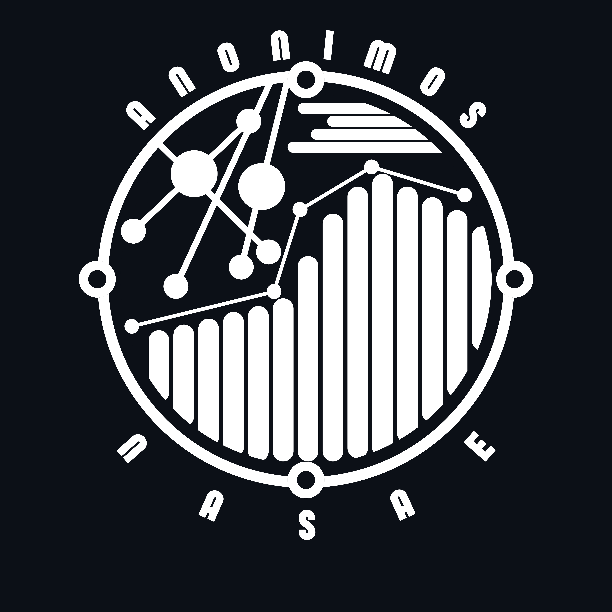
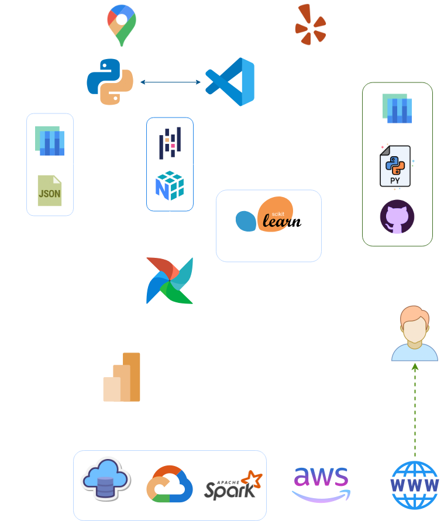
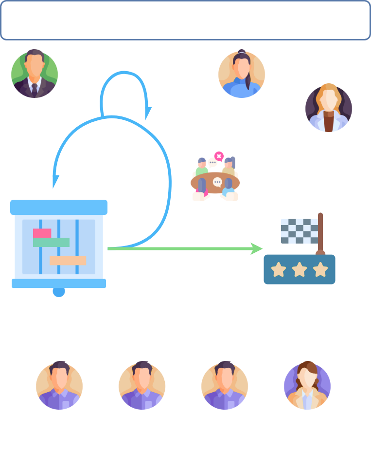

# <h1 align="center">**`YELP & GOOGLE MAPS - REVIEWS AND RECOMMENDATIONS`**</h1>

<h1 align='center'>Sistema de Recomendación de Locales Gastronómicos en Tampa, Florida</h1>

### Tabla de contenido

1.  [Objetivos del Proyecto](#objetivos)
2.  [KPIs](#kpis)
3.  [Stack Tecnológico](#stack)
4.  [Entregables](#entregables)
5.  [Equipo de Trabajo](#team)
6.  [Metodología de Trabajo](#method)
7.  [Contáctanos](#contact)
8.  [Autores](#autores)

<h2 align='center' id='objetivos'>Objetivos del Proyecto</h2>

Este proyecto está orientado al análisis de reseñas de usuarios en las plataformas Yelp y Google Maps, centrado en el sector gastronómico en Tampa, Florida. A través de técnicas avanzadas de análisis de sentimientos y Machine Learning, buscamos generar un entendimiento profundo de las opiniones de los usuarios, lo cual permitirá a nuestro cliente —un conglomerado de empresas de turismo— tomar decisiones basadas en datos para estrategias de expansión, marketing, y servicio al cliente.

1. **Analizar las opiniones de usuarios** de Yelp y Google Maps para identificar tendencias en la percepción de locales gastronómicos.

2. **Realizar un análisis de sentimientos** para identificar aspectos positivos y negativos en reseñas de los locales gastronómicos.

3. **Desarrollar un sistema de recomendación** para ayudar a los usuarios a descubrir nuevos lugares de acuerdo con sus experiencias previas.

4. **Identificar observaciones positivas y negativas concretas** en las reseñas para destacar los factores que más resaltan los mismos clientes.

5. Ayudar a los locales gastronómicos a **identificar las fortalezas y las debilidades** en su negocio basado en la misma opinión de sus clientes.

<h2 align='center'>Alcance</h2>

Nuestro enfoque se centra en el rubro gastronómico en general (restaurantes, bares, cafeterías, etc.) en Tampa, Florida debido a su alto PBI per cápita y su alcance turístico. Sin embargo, el análisis y modelo podrían aplicarse en un futuro a otros tipos de comercios, otros estados o ampliarse a nivel internacional.

Nuestro objetivo es la recopilación, procesamiento y análisis de datos en la ciudad antes mencionada, con el propósito de comprender las opiniones de los usuarios, anticipar tendencias de crecimiento o declive en el sector gastronómico, seleccionar ubicaciones estratégicas y desarrollar un sistema de recomendación personalizado para los usuarios.

<h2 align='center' id='kpis'>KPIs</h2>

### Tendencia de satisfacción en periodos de tiempo:

Este KPI mide la satisfacción de los clientes en un mes. Los inversores necesitan saber si los clientes están contentos con la oferta general del restaurante. Si la satisfacción baja, podría indicar problemas que afecten la rentabilidad, como la pérdida de clientes o una reputación negativa. Mantener este indicador alto asegura mayores probabilidades de fidelización y recomendaciones. 

**Σ Puntaje de satisfaccion de usuarios en el mes / Total de opiniones recibidas en el mes**

#### Objetivo:

**Lograr un aumento del 7%**

### Tasa de Crecimiento de Reseñas Positivas y Negativas Trimestral:

Este KPI permite evaluar las tendencias en la percepción del cliente. Un aumento de reseñas positivas sugiere que la estrategia de calidad está funcionando, mientras que un aumento en las negativas puede señalar problemas operativos. Conocer estos cambios es vital para los inversores, que pueden tomar decisiones sobre ajustes en la estrategia de negocio o marketing.

Definiendo a las reseñas positivas y negativas como:
- ✅ **Reseñas positivas:** Aquellas con un rating de 4 o 5 estrellas.

**[(Total de reseñas ✅ en el trimestre - Total de reseñas ✅ el trimestre anterior) / Total de reseñas ✅ el trimestre anterior] * 100**

#### Objetivo:

**Lograr un aumento del 12% en las reseñas positivas**

- ❌ **Reseñas negativas:** Aquellas con un rating de 1 o 2 estrellas.

**[(Total de reseñas ❌ en el trimestre - Total de reseñas ❌ el trimestre anterior) / Total de reseñas ❌ el trimestre anterior] * 100**

#### Objetivo:

**Lograr una reduccion del 8% en las reseñas negativas**

### Índice de Sentimiento Positivo Superior a 3.5 Respecto al Año Anterior:

Este KPI compara el sentimiento de los usuarios en relación con el año anterior. Si el índice es alto, indica que el restaurante ha mejorado su imagen y esfuerzos por brindar una experiencia positiva. Esto tranquiliza al inversor, ya que un índice estable o en aumento puede atraer a más clientes y potenciales socios comerciales." Este kpi se define y elige en base al promedio general del índice en los restaurantes que se filtraron luego del ETL, dichos valores variaban entre 3 y 4.8 y se selecciono ese promedio.

**Σ Puntaje de opiniones positivas / Total de opiniones**

#### Objetivo:
**Lograr tener un sentimiento positivo superior al 3.5 respecto al año anterior**

<h2 align='center' id='entregables'>Entregables</h2>

- [Diccionario de Datos y Diaframa ER](reports/documentation/DiccionarioDatos_diagramaER.pdf)
- [Análisis Exploratorio de Datos](notebooks/ETLs%20&%20EDAs/)
- Automatización de la carga incremental y transformación de los datos.
- Informe sobre la [Calidad de los datos](reports/documentation/Informe%20sobre%20la%20Calidad%20de%20los%20Datos.docx.pdf)
- Modelo de [Análisis de Sentimientos](notebooks/MachineLearning)
- Modelo de [Recomendación](notebooks/MachineLearning/)
- Modelo de Recomendación en la carpeta [Machine Learning](notebooks/MachineLearning/)
- Modelo de [Procesamiento de Lenguaje Natural](notebooks/MachineLearning/)
- Dashboard Interactivo
- [Página web](#) del servicio

<h2 align='center' id='stack'>Stack Tecnológico</h2>

<h2 align='center' id='team'>Equipo de Trabajo</h2>

    <b><a href='https://github.com/AballayNicolas' target="blank">Nicolás Aballay:</b></a> Data Engineer

    <b><a href='https://github.com/Santino-Rocchietti' target="blank">Santino Rocchietti:</b></a> Data Engineer

    <b><a href='https://github.com/aestebangnivia23' target="blank">Esteban Nivia:</b></a> Data Analyst

    <b><a href='https://github.com/ArtiomDiakov' target="blank">Artiom Diakov:</b></a> Machine Learning Engineer

    <b><a href='https://github.com/DataSciGina' target="blank">Agostina Fernández:</b></a> Machine Learning Engineer

<h2 align='center' id='method'>Metodología de Trabajo</h2>

Utilizaremos un método de trabajo ágil con enfoque en la metodología **SCRUM** apoyándonos en el software de administración de proyectos **Jira**, en donde dividiremos y asignaremos las actividades a realizar, actualizaremos nuestro **diagrama de Gantt** y mantendremos un seguimiento a todo el proyecto. Los pilares de nuestra metodología son:

- Gestión de trabajo colaborativo a través de la puesta en común de los avances.
- Resoluciones rápidas y efectivas, reuniones diarias y comunicación fluida.
- Visualización del flujo de trabajo y división de roles.
- Simplicidad en las soluciones.

<h2 align='center' id='contact'>Contáctanos</h2>

¿Te gustaría aportar algo al proyecto, darnos una opinión, colaborar con nosotros o proponernos algo? <b>¡Contáctanos!</b> Nos encantaría conocer tu opinión:

<h3 align='center'><b>Nicolás Aballay</b></h3> 

📫 thedarkin32@gmail.com

    
    

<h3 align='center'><b>Santino Rocchietti</b></h3> 

📫 santirocchietti777@gmail.com

    
    

<h3 align='center'><b>Esteban Nivia</b></h3>

📫 aestebangnivia23@gmail.com

    
    

<h3 align='center'><b>Artiom Diakov</b></h3>

📫 artiomdiakov@gmail.com

    
    

<h3 align='center'><b>Agostina Fernández</b></h3>

📫 fernandezagostina.ra@gmail.com

    
    

<h2 align='center' id='autores'>Autores</h2>

<b>Nicolás Aballay</b>

<b>Santino Rocchietti</b>

<b>Esteban Nivia</b>

<b>Artiom Diakov</b>

<b>Agostina Fernández</b>

